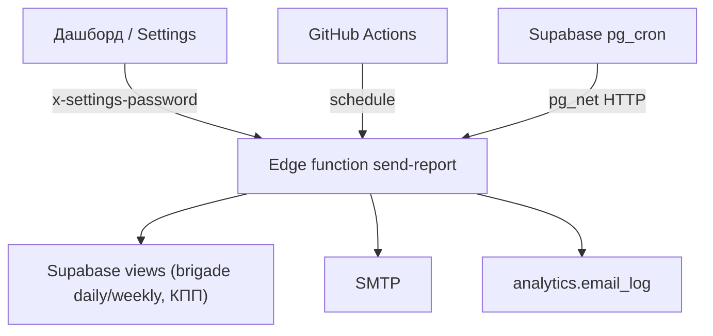

# Email Reports

Рассылка ежедневного и еженедельного отчётов заказчику на почту.

## Архитектура

Сайт статический (GitHub Pages), поэтому отправка идёт через Supabase Edge Function
[`supabase/functions/send-report/index.ts`](../supabase/functions/send-report/index.ts):

- собирает данные из view `brigade_daily_metrics` / `brigade_weekly_metrics` и `shift_daily_metrics` (КПП);
- рендерит HTML-письмо;
- отправляет через SMTP (denomailer);
- пишет результат в `analytics.email_log`.

Список получателей хранится в `analytics.email_recipients` и управляется через ту же функцию (эндпоинт `?resource=recipients`), доступ по паролю админки.



## Что в письме

- Ежедневный: вышло на смену (всего и по бригадам), активность %, простой %, список сотрудников на КПП (зона 13).
- Еженедельный: по бригадам за неделю (Пн–Вс) — чел./день, уникальные сотрудники, активность %, простой %, смены на КПП.

## Секреты

Edge function (через `supabase secrets set`):

- `SETTINGS_ADMIN_PASSWORD` — общий пароль админки (уже есть)
- `REPORT_CRON_SECRET` — отдельный секрет для pg_cron (рекомендуется; заголовок `x-report-cron-secret`)
- `SMTP_HOST`, `SMTP_PORT` (по умолчанию 465), `SMTP_USER`, `SMTP_PASSWORD`, `SMTP_FROM`, `SMTP_TLS` (`true`/`false`)
- `SUPABASE_URL`, `SUPABASE_SERVICE_ROLE_KEY` — проставляются платформой автоматически

GitHub Actions (для авторассылки):

- `VITE_SUPABASE_URL`, `VITE_SUPABASE_PUBLISHABLE_KEY`, `SETTINGS_ADMIN_PASSWORD` (уже есть)

## Деплой функции

```bash
supabase functions deploy send-report --no-verify-jwt
supabase secrets set SMTP_HOST=... SMTP_PORT=465 SMTP_USER=... SMTP_PASSWORD=... SMTP_FROM=... SMTP_TLS=true
```

## Расписание

Два независимых канала (дубликаты отсекаются через `email_log`):

### 1. GitHub Actions

Workflow [`.github/workflows/send-reports.yml`](../.github/workflows/send-reports.yml) (после импорта из Drive в **07:50 МСК**, см. [drive-sync.md](drive-sync.md)):

- сразу после успешного **Sync Drive Reports** — дневной отчёт, как только данные в БД;
- `05:00 UTC` (**08:00 МСК**) — daily за вчера;
- `05:20 UTC` (**08:20 МСК**) — резерв daily (дедлайн 08:30);
- `05:25 UTC` по понедельникам (**08:25 МСК**) — weekly за прошлую неделю.

### 2. Supabase pg_cron (резерв, если GitHub задержался)

Миграция [`20260714_report_send_pg_cron.sql`](../supabase/migrations/20260714_report_send_pg_cron.sql) + секреты в Vault
([`supabase/scripts/setup-report-cron-secrets.sql`](../supabase/scripts/setup-report-cron-secrets.sql)):

| Задача | Cron (UTC) | МСК | Действие |
|--------|------------|-----|----------|
| `legenda-send-daily-early` | `52,55,58 4 * * *` | 07:52–07:58 | daily |
| `legenda-send-daily-watchdog` | `0,5,10,15,20,25,30 5 * * *` | 08:00–08:30 | daily каждые 5 мин |
| `legenda-send-weekly-mon` | `25,30 5 * * 1` | 08:25–08:30 пн | weekly |

Планировщик в Postgres обычно срабатывает точнее, чем GitHub Actions cron.

**Настройка (один раз):**

1. Применить миграцию `20260714_report_send_pg_cron.sql` в SQL Editor.
2. Подставить URL, anon key и пароль админки в `setup-report-cron-secrets.sql` и выполнить.
3. Убедиться, что в `cron.job` есть три задачи `legenda-send-*`.

Автоматическая рассылка **не позднее 08:30 МСК** (поздние запуски GitHub Actions и pg_cron пропускаются в `send-report`).

Повторная отправка за тот же период по расписанию пропускается (см. `email_log`, `skipped: already_sent`).

Ручной запуск: Actions → **Send Reports** → Run workflow → выбрать `daily`/`weekly`.

## Ручная отправка с сайта

Страница **Настройки** (`#/settings`):

- загрузить список получателей (нужен пароль `SETTINGS_ADMIN_PASSWORD`);
- отправить дневной или недельный отчёт, либо открыть предпросмотр.

Пароль тот же, что в GitHub Secrets → `SETTINGS_ADMIN_PASSWORD` и в Supabase secrets.

## Управление получателями

Страница `#/settings` → блок «Получатели отчётов»:

- загрузить список (по паролю), отредактировать email/метку и флаги `Ежедневно` / `Еженедельно` / `Активен`, сохранить.
- флаги определяют, в какую рассылку попадёт адрес.

## Troubleshooting

| Симптом | Причина |
|---------|---------|
| `SMTP настройки не заданы` | Не проставлены секреты SMTP_* у функции |
| `Нет данных за период` | За выбранный день/неделю нет импортированных смен |
| Письмо не пришло, лог `failed` | Проверить SMTP-креды, порт/TLS, лимиты провайдера |
| `Неверный пароль админки` / HTTP 401 из pg_cron | В Vault неверный `report_cron_admin_password` или не задан `REPORT_CRON_SECRET`; см. `setup-report-cron-secrets.sql` |
