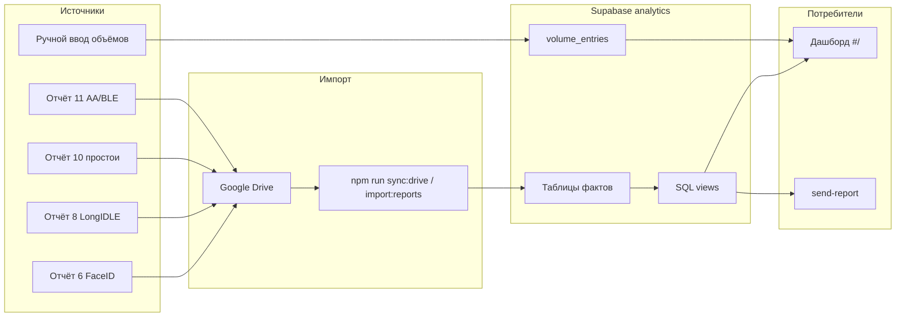

# Архитектура проекта Legenda / Work Watch Analytics

> **Живой документ.** Описывает фактическое состояние репозитория на момент последнего
> обновления. При расхождении с кодом приоритет у кода; этот файл нужно править вместе
> с изменениями.

## Назначение

Веб-дашборд и рассылка аналитики по сменам на объекте **Легенда**: посещаемость,
активность, зоны, КПП, длительные простои, ручные объёмы. Данные приходят из отчётов
Workwatch (XLS в Google Drive), импортируются в Supabase, отображаются на
[GitHub Pages](https://its-helper.github.io/legenda/) и уходят заказчику по почте.

---

## Опорные справочники (единые источники правды)

| Документ | Назначение | Кодовая копия |
|----------|------------|---------------|
| [metrics-reference.md](./metrics-reference.md) | Определения метрик отчётов 6, 8, 10, 11 | — |
| [zones-reference.md](./zones-reference.md) | Числовые коды зон `zona` / `ble_tag_zone` | [`src/lib/zones.ts`](../src/lib/zones.ts) |
| [report-sources.md](./report-sources.md) | Структура импортируемых XLS, колонки, join | скрипты в `scripts/` |

**Правило для UI, писем и кода:** подписи метрик и зон должны соответствовать
`metrics-reference.md` и `zones-reference.md`. Поля **`sleep`**, **`wear`**,
**`working_hours`**, **`work_code`**, **`chosen_metka`**, **`chosen_mapped_metka`**
не выводить как метрики.

**Язык интерфейса:** русский по умолчанию (см. `AGENTS.md`).

---

## Стек

| Слой | Технологии |
|------|------------|
| Фронтенд | React 19, TypeScript, Vite, статика на GitHub Pages |
| БД и API | Supabase (PostgreSQL, схема `analytics`, PostgREST) |
| Серверная логика | Supabase Edge Functions (Deno) |
| Импорт | Node.js (`scripts/`), `xlsx`, Google Drive API |
| CI/CD | GitHub Actions (деплой, sync Drive, рассылка) |

Отдельного Node/Fastify API нет — чтение метрик идёт напрямую в Supabase; запись
настроек, объёмов и рассылка — через edge functions с паролем админки.

---

## Схема данных (высокий уровень)



### Импортируемые отчёты

| Отчёт | Файл в Drive | Таблица(ы) | Обязательный |
|-------|--------------|------------|--------------|
| 6 FaceID | `6_report_6_faceID_arh` | `shifts`, `employees`, `supervisors`, `schedules` | да |
| 11 AA/BLE | `aa_ble_arh` | `ble_minute_facts` | да |
| 8 LongIDLE | `8_report_8_LongIDLE_arh` | `long_idle_facts` | да |
| 10 Длительные простои | `10_report_10_long_idle_arh` | `idle_episodes` | нет |

Подробности колонок и join — [report-sources.md](./report-sources.md), [drive-sync.md](./drive-sync.md).

Каждый день импорта — запись в `import_batches` + `import_files`. Повторный импорт
за ту же дату возможен (см. workflow `force`).

---

## Таблицы и представления Supabase

Полная схема: [`supabase/schema.sql`](../supabase/schema.sql). Миграции:
`supabase/migrations/`.

### Сырые факты

| Таблица | Зерно данных |
|---------|--------------|
| `ble_minute_facts` | 1 строка = 1 минута трекинга (отчёт 11) |
| `shifts` | 1 строка = смена сотрудника (отчёт 6) |
| `long_idle_facts` | 1 строка = тех. сессия с агрегатами idle (отчёт 8) |
| `idle_episodes` | 1 строка = эпизод длительного простоя (отчёт 10) |
| `volume_entries` | Ручные показатели объёмов за день (не из WW) |

### Аналитические view (читает дашборд и письма)

| View | Назначение |
|------|------------|
| `shift_daily_metrics` | Метрики по смене за день: work, weak, long_idle, go, total, pv, kpp |
| `brigade_daily_metrics` | Агрегат по бригаде (`supervisor_name`) за день |
| `brigade_weekly_metrics` | Агрегат по бригаде за неделю (Пн–Вс) |
| `zone_daily_metrics` | Время по `zona` за день (по бригаде) |
| `idle_episodes_daily` | Эпизоды простоя ≥ 10 мин (публичный доступ к отчёту 10) |
| `kpp_minutes_daily` | Минуты в зоне КПП для интервалов времени на UI |

### Ключевые формулы (прикладные)

Все проценты активности на дашборде считаются от **`total_sec`** (сумма минут
трекинга за смену/день), если не указано иное.

| Метрика на UI | Источник | Формула / правило |
|---------------|----------|-------------------|
| **Активность** | `work_sec` | `work_sec / total_sec × 100` |
| **Слабая активность** | `weak_activity_sec` | `idle_sec` минус длительный простой (отчёт 10), см. view `shift_daily_metrics` |
| **Длительный простой** | `long_idle_sec` | Сумма эпизодов отчёта 10 с `duration_min ≥ 10` |
| **Ходьба между зонами** | `go_sec` | `go_sec / total_sec × 100` |
| **В рабочей зоне (ПВ)** | `zone_daily_metrics`, zona=1 | Доля zona 1 от суммы времени **по зонам без zone=0** (как блок 4) |
| **Замечены на КПП** | `kpp_sec_total > 0` | zona=13; **обед 13:00–14:00 МСК не учитывается** (`is_kpp_metric_minute`) |
| **Длительность смены** | отчёт 6 | `on_watch_duration_seconds`, среднее по бригаде |
| **Вышло на смену** | count смен | План: 50 всего, по бригадам Джалол 20 / ЛИ СОН ХАК 22 |
| **Требуют внимания** | активность смены | &lt; 30% (`LOW_ACTIVITY_THRESHOLD`) |
| **Объёмы** | `volume_entries` | Ручной ввод; чтение/запись через edge function `volume-entries` |

Зона **0** («вне зоны») в UI **скрыта** (`HIDDEN_ZONES` в `zones.ts`), в расчёте
ПВ на карточке блока 1 не участвует.

---

## RLS и доступ к данным

| Данные | Чтение (anon) | Запись |
|--------|---------------|--------|
| Views метрик (`brigade_*`, `shift_*`, `zone_*`, …) | `GRANT SELECT` | только импорт (service role) |
| `ble_minute_facts`, `idle_episodes` (база) | закрыто RLS | service role |
| `idle_episodes_daily`, `kpp_minutes_daily` | view поверх закрытых таблиц | — |
| `volume_entries` | `SELECT` + policy `volume_entries_public_read`; на практике чтение через edge function с паролем | edge function `volume-entries` (PUT) |
| `email_recipients`, `email_log` | закрыто | edge function `send-report` |
| `site_settings` | только `front_ui_text` (published) | edge function `site-settings` |

Пароль админки: секрет `SETTINGS_ADMIN_PASSWORD`, заголовок `x-settings-password`.

---

## Edge Functions

| Функция | Методы | Назначение |
|---------|--------|------------|
| [`site-settings`](../supabase/functions/site-settings/index.ts) | GET, PUT, POST | Черновик и публикация `front_ui_text` |
| [`send-report`](../supabase/functions/send-report/index.ts) | GET, POST, PUT | HTML-письма daily/weekly, получатели, предпросмотр |
| [`volume-entries`](../supabase/functions/volume-entries/index.ts) | GET, PUT | Чтение и сохранение объёмов за день |
| [`admin-report-upload`](../supabase/functions/admin-report-upload/index.ts) | — | Загрузка отчётов из настроек (если используется) |

Деплой: `supabase functions deploy <name> --no-verify-jwt`

Подробнее о почте: [email-reports.md](./email-reports.md).

---

## Фронтенд

### Маршруты

| URL | Страница | Файл |
|-----|----------|------|
| `#/` | Дашборд | [`src/pages/DashboardPage.tsx`](../src/pages/DashboardPage.tsx) |
| `#/settings` | Настройки, импорт, рассылка | [`src/pages/SettingsPage.tsx`](../src/pages/SettingsPage.tsx) |

Вход по паролю: [`src/context/AuthContext.tsx`](../src/context/AuthContext.tsx),
проверка через `site-settings?action=verify`.

### Дашборд — 6 блоков

| № | Блок | Компоненты / данные |
|---|------|---------------------|
| 1 | **Ежедневная аналитика** | 8 карточек метрик, карточки бригад, топ-3, «требуют внимания», КПП | `brigade_daily_metrics`, `shift_daily_metrics`, `kpp_minutes_daily`, `volume_entries` |
| 2 | **Еженедельная аналитика** | Карточки бригад за неделю, топ-3, внимание | `brigade_weekly_metrics`, смены за диапазон |
| 3 | **Динамика активности** | Джалол / ЛИ СОН ХАК: день vs вчера, спарклайн 7 дней | `brigade_daily_metrics` |
| 4 | **Местоположение и простои** | Распределение по зонам, эпизоды простоя | `zone_daily_metrics`, `idle_episodes_daily` |
| 5 | **Объёмы** | Ручной ввод таблицей | [`VolumesPanel`](../src/components/VolumesPanel.tsx), `volume-entries` |
| 6 | **Детализация** | Сортируемая таблица смен | `shift_daily_metrics` |

Загрузчики и типы: [`src/lib/reports.ts`](../src/lib/reports.ts).  
Объёмы: [`src/lib/volumes.ts`](../src/lib/volumes.ts).  
Зоны: [`src/lib/zones.ts`](../src/lib/zones.ts).

### Переиспользуемые компоненты

- `CollapsibleBlock` — сворачиваемые секции
- `ActivityDynamicsPanel`, `TopActivityPanel`, `AttentionPanel`
- `StructureBar` — полоса структуры времени (активность / слабая / простой / ходьба)

Тексты UI: `analytics.site_settings` → [`src/content/uiText.ts`](../src/content/uiText.ts).

---

## Пайплайн импорта

```text
Google Drive (LEGENDA/)
  → scripts/sync-drive-reports.mjs  (cron 02:30–04:30 UTC, workflow_dispatch)
  → scripts/import-reports.mjs      (локально: npm run import:reports)
  → Supabase service role → analytics.*
  → пересчёт view автоматически (PostgreSQL)
```

Локальный импорт: [local-import.md](./local-import.md).  
Настройка Supabase: [supabase-setup.md](./supabase-setup.md).

---

## GitHub Actions

| Workflow | Расписание | Действие |
|----------|------------|----------|
| [`deploy-pages.yml`](../.github/workflows/deploy-pages.yml) | push в `main` | `npm run build` → GitHub Pages |
| [`sync-drive-reports.yml`](../.github/workflows/sync-drive-reports.yml) | 02:30/04:00/04:30 UTC | Импорт вчера (МСК) из Drive (~04:00 файлы в папке) |
| [`send-reports.yml`](../.github/workflows/send-reports.yml) | 05:00 UTC daily, пн 05:30 | Вызов `send-report` (08:00 / 08:30 МСК) |

При сбое deploy с сообщением *«Deployment failed, try again later»* — временный сбой
GitHub Pages; помогает **Re-run failed jobs**.

---

## Переменные окружения

### Фронт (Vite, GitHub Secrets)

- `VITE_SUPABASE_URL`
- `VITE_SUPABASE_PUBLISHABLE_KEY`

### Импорт и edge functions

- `SUPABASE_SERVICE_ROLE_KEY`
- `SETTINGS_ADMIN_PASSWORD`
- Google: `GOOGLE_DRIVE_FOLDER_ID`, `GOOGLE_SERVICE_ACCOUNT_JSON` (или email + key)
- SMTP для писем: `SMTP_HOST`, `SMTP_PORT`, `SMTP_USER`, `SMTP_PASSWORD`, `SMTP_FROM`

Пример: [`.env.example`](../.env.example).

---

## Структура репозитория

```text
legenda/
├── src/                    # React-приложение
│   ├── pages/              # DashboardPage, SettingsPage, LoginPage
│   ├── components/         # UI-блоки дашборда
│   ├── lib/                # reports, volumes, zones, supabase, edgeFunctions, …
│   └── content/uiText.ts   # дефолтные тексты
├── supabase/
│   ├── schema.sql          # полная схема analytics
│   ├── migrations/         # инкрементальные миграции
│   └── functions/          # edge functions
├── scripts/                # импорт, sync Drive, миграции
├── docs/                   # документация (этот файл, справочники)
└── .github/workflows/      # CI/CD
```

---

## Чеклист при добавлении новой метрики

1. Есть ли определение в [metrics-reference.md](./metrics-reference.md)? Если нет — сначала зафиксировать там.
2. Откуда поле в SQL: `ble_minute_facts`, `idle_episodes`, агрегат в `shift_daily_metrics`?
3. Нужен ли новый столбец во view или достаточно фронтового расчёта?
4. Подпись на русском, согласованная со справочником.
5. Если затрагивает письмо — обновить [`send-report/index.ts`](../supabase/functions/send-report/index.ts).
6. Не использовать запрещённые поля (`sleep`, `wear`, …).

---

## Связанные документы

| Файл | Когда читать |
|------|--------------|
| [metrics-reference.md](./metrics-reference.md) | Определения метрик WW |
| [zones-reference.md](./zones-reference.md) | Коды зон |
| [report-sources.md](./report-sources.md) | Колонки XLS |
| [drive-sync.md](./drive-sync.md) | Автоимпорт из Drive |
| [email-reports.md](./email-reports.md) | Рассылка |
| [local-import.md](./local-import.md) | Ручной импорт |
| [supabase-setup.md](./supabase-setup.md) | Первичная настройка БД |
| [analytics-architecture.md](./analytics-architecture.md) | Устаревший черновик MVP (англ.); не отражает текущий прод |

---

## История ключевых доработок (кратко)

- Дашборд: структура времени (активность / слабая / длительный простой / ходьба), зоны, КПП без обеда, динамика по бригадам.
- Отчёт 10: эпизоды простоя ≥ 10 мин, привязка к зоне.
- Средняя длительность смены из отчёта 6.
- Карточки ПВ и объёмов в блоке 1; блок 5 — ручной ввод `volume_entries`.
- Чтение объёмов через edge function + RLS policy (миграции `20260712`, `20260713`).
